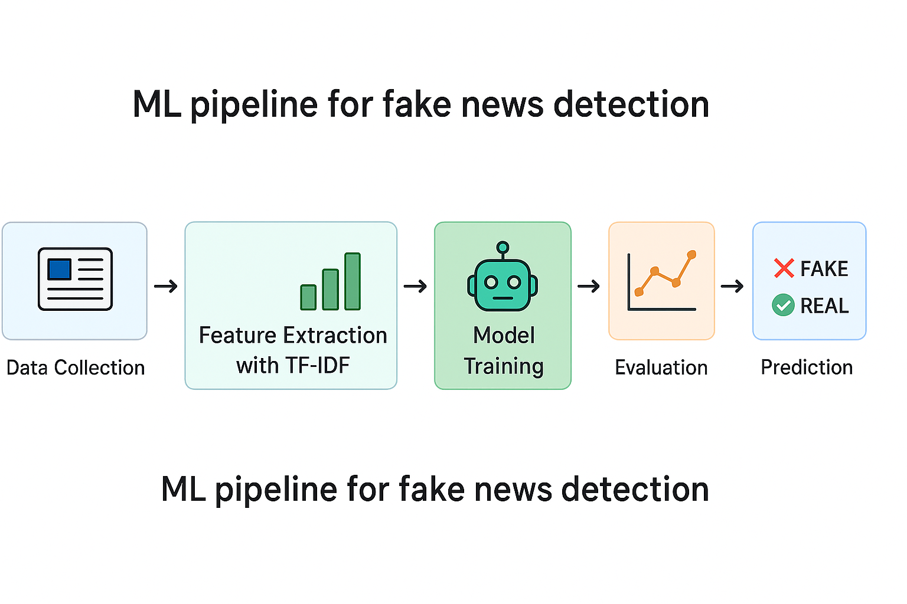

# 📰 Fake News Detection Using Machine Learning

This project builds a robust machine learning model to classify fake versus real news.  
It aims to combat misinformation, especially during crucial democratic events in **Taiwan 🇹🇼** and the **2024 U.S. presidential election 🇺🇸**.

Developed as part of the University of Chicago’s Applied Data Science program, this work is designed for **both technical and non-technical audiences**.

---

## 🎯 Project Goals

1. **Accurately classify news articles** as real or fake.
2. **Apply machine learning models** to detect misinformation.
3. **Visualize model performance** to help stakeholders understand the reliability of results.

This solution is critical for preserving information integrity in an age of mass disinformation.

---

## 📊 Key Findings

- **SVM with RBF kernel** performed the best with nearly **90% accuracy**.
- **TF-IDF** was used for feature extraction, enabling the model to capture text relevance.
- **Random Forest and Decision Trees** also showed strong performance, with lower interpretability compared to SVM.

### 🧪 Models Evaluated
| Model               | Accuracy | Notable Notes                                |
|--------------------|----------|----------------------------------------------|
| Logistic Regression| Moderate | Linear model; baseline                       |
| Decision Tree      | Good     | Handles non-linearity; may overfit           |
| Random Forest      | Better   | Ensemble model; more robust                  |
| SVM (RBF) ✅        | **Best** | High accuracy with tuned hyperparameters     |

---

## 🔍 How It Works (Non-Technical Overview)

1. **Data Cleaning** — Strip URLs, special characters, tabs, and non-English content.
2. **Stop Words Removal** — Focus only on informative words.
3. **Tokenization** — Break down text into individual words.
4. **TF-IDF Vectorization** — Convert text into numeric features for model consumption.
5. **Model Training** — Compare multiple ML models.
6. **Evaluation** — Accuracy, F1 Score, ROC AUC, Confusion Matrix.

<p align="center">
  <br>
  <em>Example ML pipeline for fake news detection</em>
</p>

---

## 📂 Repository Structure

```
.
├── Fake News Detection.ipynb        # Full notebook with model training and evaluation
├── Fake News Detection.html         # Visual output (optional, for non-technical users)
├── requirements.txt                 # Python dependencies
└── README.md                        # Project documentation (this file)
```

---

## 🚀 How to Use

### For Non-Technical Users
Simply open the `.html` file in your browser (if available) to explore the analysis visually.

### For Technical Users

1. **Clone the repository**
   ```bash
   git clone https://github.com/edwnhsu/Fake-News-Detection.git
   cd Fake-News-Detection
   ```

2. **Set up a virtual environment (recommended)**
   ```bash
   python -m venv venv
   source venv/bin/activate      # For Mac/Linux
   venv\Scripts\activate         # For Windows
   ```

3. **Install dependencies**
   ```bash
   pip install -r requirements.txt
   ```

4. **Launch Jupyter Notebook**
   ```bash
   jupyter notebook
   ```

5. **Open notebook**
   - Run `Fake News Detection.ipynb` to reproduce the full workflow.

---

## 🧠 Why It Matters

- Fake news spreads rapidly and shapes public opinion.
- Machine learning can help combat this threat **at scale**.
- This project highlights the **power of text analytics** in real-world social applications.

---

## 📚 References

- Kumar S, Asthana R, Upadhyay S, Upreti N, Akbar M (2019)  
  _Fake news detection using deep learning models: a novel approach._  
  *Transactions on Emerging Telecommunications Technologies*

---

## 📬 Contact

**Yu-Wei (Edwin) Hsu**  
📫 GitHub: [@edwnhsu](https://github.com/edwnhsu)  
📧 Email: edwinhsu@uchicago.edu
